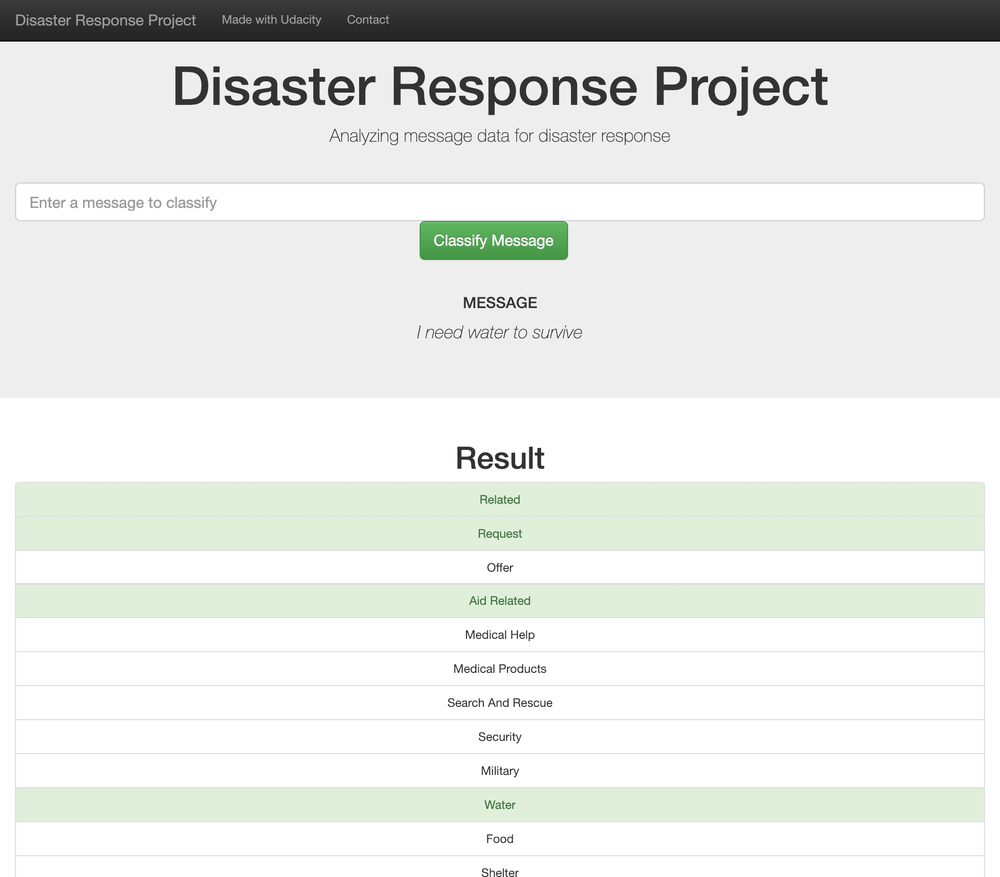
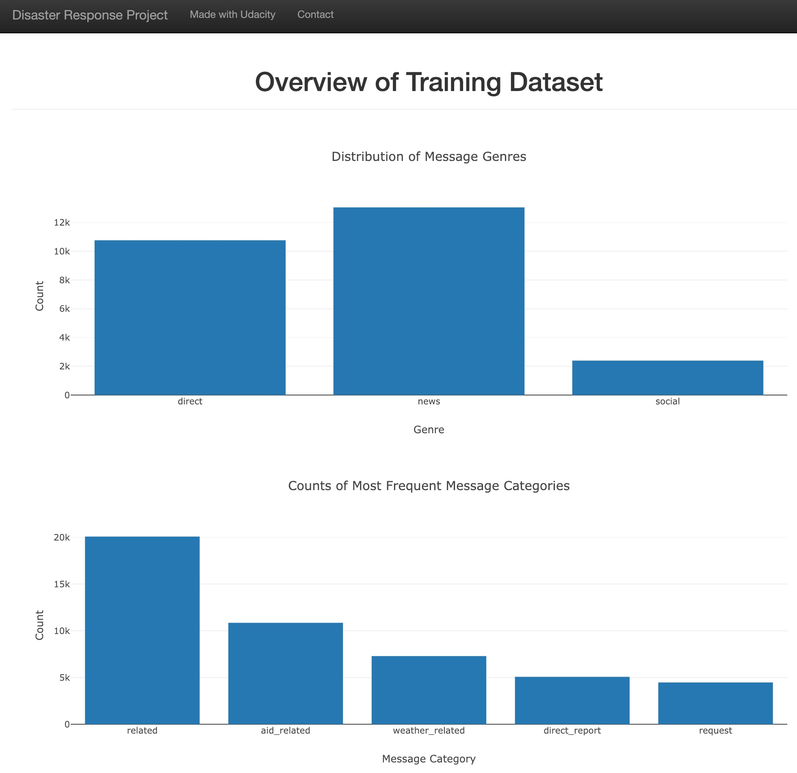

# Disaster Response Pipeline Project

# Installation

The libraries/packages used are:

- json
- plotly
- pandas
- nltk
- flask
- sklearn
- sqlalchemy
- numpy
- sqlalchemy
- pickle
- re
- sys
- warnings

# Project Motivation
The project is part of the [Udacity Data Scientist Nanodegree](https://www.udacity.com/course/data-scientist-nanodegree--nd025) - Term2 Applied Data Science. The project is to build a data pipeline to prepare message data from major natural disasters around the world, and build a machine learning pipeline to categorize emergency messages based on the needs communicated by the sender. The dataset was provided by [Figure Eight](https://www.figure-eight.com/). ([Source](https://www.udacity.com/course/data-scientist-nanodegree--nd025))

# File Descriptions
**app folder**
1. templates: the folder contains two files, `master.html` and `go.html`. `master.html` is the main page of web app. `go.html` is the classification result page of web app.
2. `run.py` is the Flask file that runs app.

**data folder**
1. `disaster_categories.csv` : input data to process 
2. `disaster_messages.csv`:  input data to process
3. `process_data.py`: creates a data cleaning pipeline that:
    1. Loads the messages and categories datasets
    2. Merges the two datasets
    3. Cleans the data
    4. Stores it in a SQLite database
4. `DisasterResponse.db`: the database to save clean data to

**models folder**
1. `classifier.pkl`: the file that saves the model
2. `train_classifier.py`:
    1. Loads data from the SQLite database
    2. Splits the dataset into training and test sets
    3. Builds a text processing and machine learning pipeline
    4. Trains and tunes a model using GridSearchCV
    5. Outputs results on the test set
    6. Exports the final model as a pickle file

**screenshot folder**
1. `screenshot1`: screenshot of the classification result page of the web app
2. `screenshot2`: screenshot of the exploratory analysis of the input data using `plotly`.

# Instructions:
1. Run the following commands in the project's root directory to set up your database and model.

    - To run ETL pipeline that cleans data and stores in database
        `python data/process_data.py data/disaster_messages.csv data/disaster_categories.csv data/DisasterResponse.db`
    - To run ML pipeline that trains classifier and saves
        `python models/train_classifier.py data/DisasterResponse.db models/classifier.pkl`

2. Run the following command in the app's directory to run your web app.
    `python run.py`

1. Go to http://0.0.0.0:3001/

# Screenshots of the App

# Licensing, Authors, Acknowledgements
1. Credits to https://github.com/paawan01/Titanic_dataset_analysis for the readme template
2. I used below reference when building the machine learning model:
    - [Multi Label Text Classification with Scikit-Learn](https://towardsdatascience.com/multi-label-text-classification-with-scikit-learn-30714b7819c5)

